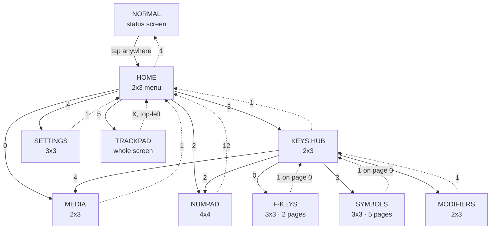

# Touch UI navigation map

Cell numbers are the landscape row-major grid indices. In portrait the 2x3 screens re-arrange
to 3x2 (see CHANGES.md); square grids keep their layout.

**Solid arrows** = forward navigation (label = the tapped cell). **Dotted arrows** = back
(the red ▲ / X; label = its cell). MEDIA and NUMPAD always return to HOME, even when entered
through the hub; F-KEYS / SYMBOLS / MODIFIERS return to the hub.

## What each screen does

| Screen | Grid | Cells |
| --- | --- | --- |
| SETTINGS | 3x3 | 0 / 3 = sensitivity + / − · 2 / 5 = brightness + / − · 4 = rotate 90° CW per tap · 6 / 8 = readouts (blue, not tappable: sens 0–10, brightness %) · 7 = empty |
| MEDIA | 2x3 | 0 = vol− · 2 = vol+ · 3 = prev · 4 = play/pause · 5 = next |
| F-KEYS | 3x3 | F1–F12, 7 keys per page · cell 1 = prev page (back to hub on page 0) · cell 7 = next page (cyclic) |
| SYMBOLS | 3x3 | 32 symbols, same paging as F-KEYS |
| NUMPAD | 4x4 | true HID Keypad codes (KP_*, not main-row digits): 0–9, + − * /, enter · operators + enter blue · cell 12 = back |
| MODIFIERS | 2x3 | one-shot mods: 0 = CTRL · 2 = SHFT · 3 = ALT · 5 = GUI · 4 = empty · armed = solid blue fill + black text, applied to the next key sent, cleared on leaving the hub family |
| TRACKPAD | whole screen | drag = pointer · scroll-lane drag (right strip landscape / bottom strip portrait) = scroll · 1 tap = left click · 2 taps = right click · tap-then-hold-and-drag = drag-lock · top-left X = exit |
