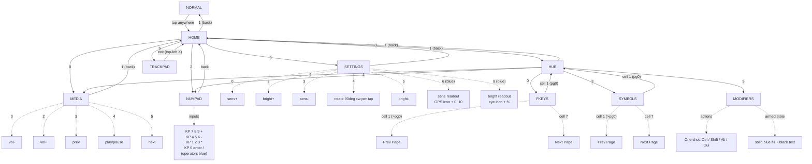

# Touch UI navigation map

Cell numbers are the landscape 2x3 / 3x3 / 4x4 grid indices (row-major). In portrait the 2x3
screens re-arrange to 3x2 (see CHANGES.md); square grids keep their layout.

```mermaid
graph TD
    %% Core Navigation
    NORMAL -- "tap anywhere" --> HOME
    HOME -- "0" --> MEDIA
    HOME -- "1 (back)" --> NORMAL
    HOME -- "2" --> NUMPAD
    HOME -- "3" --> HUB
    HOME -- "4" --> SETTINGS
    HOME -- "5" --> TRACKPAD

    TRACKPAD -- "exit (top-left X)" --> HOME

    %% Settings (3x3 layout)
    SETTINGS -- "1 (back)" --> HOME
    SETTINGS -. "0" .-> S_SensP[sens+]
    SETTINGS -. "2" .-> S_BriP[bright+]
    SETTINGS -. "3" .-> S_SensM[sens-]
    SETTINGS -. "4" .-> S_Rot[rotate 90deg cw per tap]
    SETTINGS -. "5" .-> S_BriM[bright-]
    SETTINGS -. "6 (blue)" .-> S_SensR[sens readout <br> GPS icon + 0..10]
    SETTINGS -. "8 (blue)" .-> S_BriR[bright readout <br> eye icon + %]

    %% Hub Sub-menus (keyboard sub-menu; media/numpad also reachable directly from HOME)
    HUB -- "1 (back)" --> HOME
    HUB -- "0" --> FKEYS
    HUB -- "2" --> NUMPAD
    HUB -- "3" --> SYMBOLS
    HUB -- "4" --> MEDIA
    HUB -- "5" --> MODIFIERS

    %% Media Actions (reachable from HOME cell 0 or HUB cell 4; back always -> HOME)
    MEDIA -- "1 (back)" --> HOME
    MEDIA -. "0" .-> M_VolM[vol-]
    MEDIA -. "2" .-> M_VolP[vol+]
    MEDIA -. "3" .-> M_Prev[prev]
    MEDIA -. "4" .-> M_Play[play/pause]
    MEDIA -. "5" .-> M_Next[next]

    %% Paginated Menus (FKeys / Symbols - 3x3, 7 keys/page)
    FKEYS -- "cell 1 (pg0)" --> HUB
    FKEYS -. "cell 1 (>pg0)" .-> FK_Prev[Prev Page]
    FKEYS -. "cell 7" .-> FK_Next[Next Page]

    SYMBOLS -- "cell 1 (pg0)" --> HUB
    SYMBOLS -. "cell 1 (>pg0)" .-> SYM_Prev[Prev Page]
    SYMBOLS -. "cell 7" .-> SYM_Next[Next Page]

    %% Numpad (4x4 layout, true HID Keypad codes -- KP_*, not main-row digits).
    %% Reachable from HOME cell 2 or HUB cell 2; back always -> HOME.
    NUMPAD -- "back" --> HOME
    NUMPAD -. "inputs" .-> N_Keys["KP 7 8 9 +<br>KP 4 5 6 -<br>KP 1 2 3 *<br>KP 0 enter /<br>(operators blue)"]

    %% Modifiers
    MODIFIERS -. "actions" .-> MOD_Keys["One-shot: Ctrl / Shift / Alt / Gui"]
    MODIFIERS -. "armed state" .-> MOD_State["solid blue fill + black text"]
```
